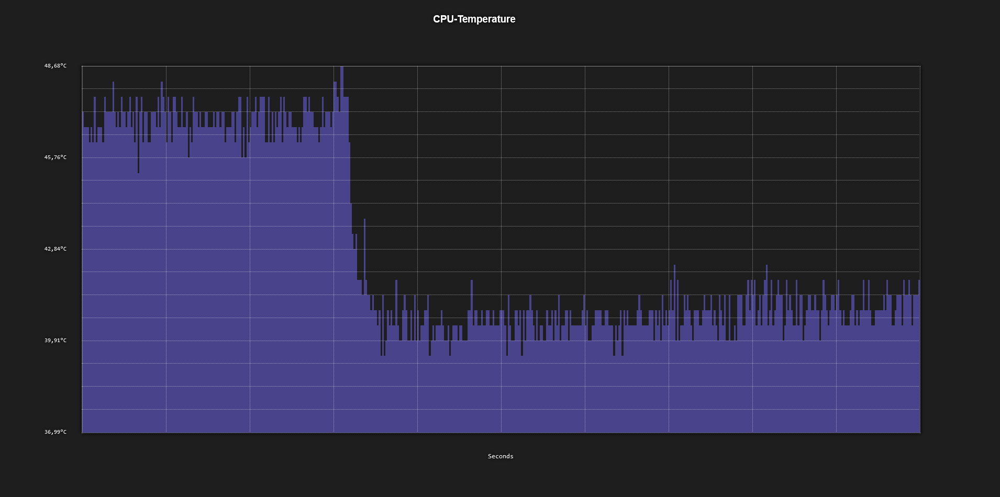

# PHP Simple Graph

## Introduction
If you happen to own a webserver with php running on it as well and had the idea to graph your cpu_temperature or other data on your web-brower? Well, then this is the place for you!

## Setup
I'll show you the setup by an example
make it stick, it's sick,
play the sample ~

You see, here in my temple,
i try to get track of my heat
you know i gotta handle.

In light you don't need to carry a candle but switch over to style.css and make it custom.
You don't need no hustlin, my (style.css) is fresh and buzzin.

Have a look in Climate.php and find out how to handle the data.
In my Sample: I see the degree of CPU's heat.  
Maybe plant a seed and see the green solar fields~

Whatever you do, i hope it comes handy. If you need anything, have a look, it's not too crafty.
